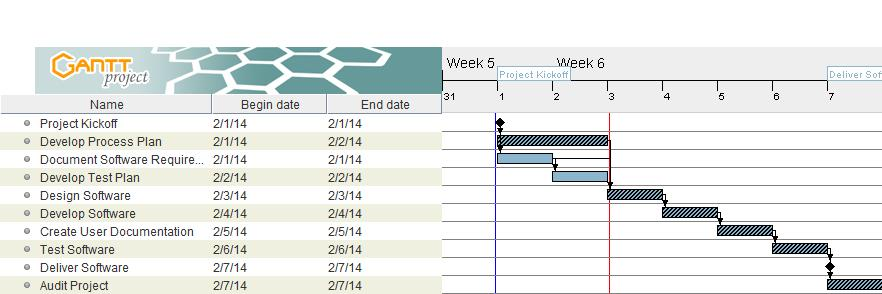

# Process Plan Document – Team 13

## 1 Introduction
This project will produce software to calculate the average length of sentences in student papers. This software is being produced for Professor Lauren at her request. 
* Software Name: CheckSentenceLength
* This software will return the average number of words per sentence within a student's paper. 

### 1.1 Definitions and Acronyms
<table>
<tbody>
	<tr>
		<td><b>Acronym</b></td>
		<td><b>Definition</b></td>
	</tr>
	<tr>
		<td>QA</td>
		<td>Quality Assurance</td>
	</tr>
</tbody>
</table>

## 2 Process Description

### 2.1 Project Lifecycle
This project will follow the waterfall lifecyle methodology where possible. Due to travel plans of the Business Analyst the Requirements Documentation will be completed in parallel with Process documentation. This should not be an issue as 1) requirements gathering was performed prior to project kickoff by different resources and 2) project process and schedule was defined during the project kickoff. 

### 2.2 Process Activities

<table>
<tbody>
	<tr width=100%>
		<td width=18%><b>Activity:</b></td>
		<td width=82%>Project Kickoff</td>
	</tr>
	<tr>		
		<td><b>Description:</b></td> 
		<td>Meeting of all the team members to discuss the project, define the roles, and establish timelines.</td>
	</tr>
	<tr>
		<td><b>Entrance criteria:</b></td> 
		<td>Team watched instruction videos and reviewed repository documents.</td>
	</tr>
	<tr>
		<td><b>Exit criteria:</b></td> 
		<td>No document deliverable.</td>
	</tr>
        <tr class="blank_row">
            <td colspan="2">&nbsp;</td>
        </tr>
        <tr>
		<td><b>Activity:</b></td> 
		<td>Develop Process Plan</td>
	</tr>
	<tr>
		<td><b>Description:</b></td> 
		<td>Document project activities required to meet client requirements.</td>
	</tr>
	<tr>
		<td><b>Entrance criteria:</b></td> 
		<td>Project Kickoff meeting completed.</td>
	</tr>
	<tr>
		<td><b>Exit criteria:</b></td> 
		<td>Project process plan that has been reviewed and approved by all project members.</td>
	</tr>
        <tr class="blank_row">
            <td colspan="2">&nbsp;</td>
        </tr>
	<tr>
		<td><b>Activity:</b></td> 
		<td>Document Software Requirements</td>
	</tr>
	<tr>
		<td><b>Description:</b></td> 
		<td>Document requirements as previously gathered. Produce a document detailling what the client requires in the software deliverable.</td>
	</tr>
	<tr>
		<td><b>Entrance criteria:</b></td> 
		<td>Requirements gathering interview video and project kickoff meeting.</td>
	</tr>
	<tr>
		<td><b>Exit criteria:</b></td> 
		<td>Software Requirements Document that has been reviewed and approved by all project members.</td>
	</tr>
        <tr class="blank_row">
            <td colspan="2">&nbsp;</td>
        </tr>
	<tr>
		<td><b>Activity:</b></td> 
		<td>Develop Test Plan</td>
	</tr>
	<tr>
		<td><b>Description:</b></td> 
		<td>Develop a document that details what needs to be tested and how it will be tested.</td>
	</tr>
	<tr>
		<td><b>Entrance criteria:</b></td> 
		<td>Software Requirements Document</td>
	</tr>
	<tr>
		<td><b>Exit criteria:</b></td> 
		<td>Test Plan Document that has been reviewed and approved by all project members.</td>
	</tr>
        <tr class="blank_row">
            <td colspan="2">&nbsp;</td>
        </tr>
	<tr>
		<td><b>Activity:</b></td> 
		<td>Design Software</td>
	</tr>
	<tr>
		<td><b>Description:</b></td> 
		<td>Design software to meet client requirements.</td>
	</tr>
	<tr>
		<td><b>Entrance criteria:</b></td> 
		<td>Software Requirements Document</td>
	</tr>
	<tr>
		<td><b>Exit criteria:</b></td> 
		<td>Design Document that has been reviewed and approved by available project members.</td>
	</tr>
        <tr class="blank_row">
            <td colspan="2">&nbsp;</td>
        </tr>
	<tr>
		<td><b>Activity:</b></td> 
		<td>Develop Software</td>
	</tr>
	<tr>
		<td><b>Description:</b></td> 
		<td>Develop software based on client requirements.</td>
	</tr>
	<tr>
		<td><b>Entrance criteria:</b></td> 
		<td>Software Requirements Document</td>
	</tr>
	<tr>
		<td><b>Exit criteria:</b></td> 
		<td>Completed software that has been unit tested.</td>
	</tr>
        <tr class="blank_row">
            <td colspan="2">&nbsp;</td>
        </tr>
	<tr>
		<td><b>Activity:</b></td> 
		<td>Create User Documentation</td>
	</tr>
	<tr>
		<td><b>Description:</b></td> 
		<td>Create a document to explain to users how to operate the software.</td>
	</tr>
	<tr>
		<td><b>Entrance criteria:</b></td> 
		<td>Software Requirements Document, Completed Software</td>
	</tr>
	<tr>
		<td><b>Exit criteria:</b></td> 
		<td>User Documentation that has been reviewed and approved by available project members.</td>
	</tr>
        <tr class="blank_row">
            <td colspan="2">&nbsp;</td>
        </tr>
	<tr>
		<td><b>Activity:</b></td> 
		<td>Test Software</td>
	</tr>
	<tr>
		<td><b>Description:</b></td> 
		<td>Develop a document that details what needs to be tested and how it will be tested.</td>
	</tr>
	<tr>
		<td><b>Entrance criteria:</b></td> 
		<td>Test Plan Document, Completed Software</td>
	</tr>
	<tr>
		<td><b>Exit criteria:</b></td> 
		<td>Test Plan Document with test case results entered. It will be complete when all the defects have been resolved.</td>
	</tr>
        <tr class="blank_row">
            <td colspan="2">&nbsp;</td>
        </tr>
	<tr>
		<td><b>Activity:</b></td> 
		<td>Deliver Software</td>
	</tr>
	<tr>
		<td><b>Description:</b></td> 
		<td>Deliver to customer Completed Software and User Documentation.</td>
	</tr>
	<tr>
		<td><b>Entrance criteria:</b></td> 
		<td>Completed Software, Completed Test Plan Document with all defects noted and resolved, User Documentation</td>
	</tr>
	<tr>
		<td><b>Exit criteria:</b></td> 
		<td>No document deliverable.</td>
	</tr>
        <tr class="blank_row">
            <td colspan="2">&nbsp;</td>
        </tr>
	<tr>
		<td><b>Activity:</b></td> 
		<td>Audit Project</td>
	</tr>
	<tr>
		<td><b>Description:</b></td> 
		<td>An independent quality organizationwill audit the project for quality of document deliverables, productivity, and quality of final software deliverable.</td>
	</tr>
	<tr>
		<td><b>Entrance criteria:</b></td> 
		<td>Completed Software, Completed Test Plan Document with all defects noted and resolved, User Documentation, team member time logs.</td>
	</tr>
	<tr>
		<td><b>Exit criteria:</b></td> 
		<td>Process Assessment Document with recommendations for improvement.</td>
	</tr>
</tbody>
</table>

## 3 Roles

### 3.1 Team member names
<ul>
<li>Annette Spyker</li>
<li>David Faour</li>
<li>James Jennings</li>
<li>Tamara Wright Muccia</li>
</ul>

### 3.2 Roles Table
<table>
<tbody>
	<tr>
		<td><b>Role</b></td>
		<td><b>Responsibility</b></td>
	</tr>
	<tr>
		<td>Client</td>
		<td>Provide software requirements. Acceptance of final product.</td>
	</tr>
	<tr>
		<td>Project Manager</td>
		<td>Schedule and monitor software creation activities. Maintain schedule 			and process documents.</td>
	</tr>
	<tr>
		<td>Business Analyst</td>
		<td>Document software requirements.</td>
	</tr>
	<tr>
		<td>Quality Assurance Analyst</td>
		<td>Design test plan.</td>
	</tr>
	<tr>
		<td>Software Architect</td>
		<td>Design software.</td>
	</tr>
	<tr>
		<td>Sotware Engineer</td>
		<td>Write software code. Perform unit testing.</td>
	</tr>
	<tr>
		<td>Technical Writer</td>
		<td>Write user documentation.</td>
	</tr>
	<tr>
		<td>Quality Assurance Tester</td>
		<td>Execute test plan.</td>
	</tr>
	<tr>
		<td>Auditor</td>
		<td>Verify client requirements have been met and that proper methods have been used.</td>
	</tr>

</tbody>
</table>

### 3.3 Role assignment table

<table>
<tbody>
	<tr>
		<td><b>Role</b></td>
		<td><b>Team member(s)</b></td>
	</tr>

	<tr>
		<td>Client</td>
		<td>Lauren</td>
	</tr>

	<tr>
		<td>Project Manager</td>
		<td>Tamara Wright Muccia.</td>
	</tr>

	<tr>
		<td>Business Analyst</td>
		<td>David Faour</td>
	</tr>

	<tr>
		<td>Quality Assurance Analyst</td>
		<td>David Faour</td>
	</tr>

	<tr>
		<td>Software Architect</td>
		<td>Annette Spyker</td>
	</tr>
	
	<tr>
		<td>Sotware Engineer</td>
		<td>Annette Spyker</td>
	</tr>

	<tr>
		<td>Technical Writer</td>
		<td>James Jennings</td>
	</tr>

	<tr>
		<td>Quality Assurance Tester</td>
		<td>James Jennings</td>
	</tr>

	<tr>
		<td>Auditor</td>
		<td>Tamara Wright Muccia</td>
	</tr>

</tbody>
</table>

## 4 Estimates

### 4.1 Effort Estimate
* Effort hours: We anticipate 40 team-member hours will be spent completing this project.
* Lines of code: We anticipate 100 or fewer lines of source code will be included in the final product.
* Defects: We expect to find two or fewer defects while testing our code.

### 4.2 Schedule

Gant Chart of initial project schedule with critical path marked by cross hatching:
 

